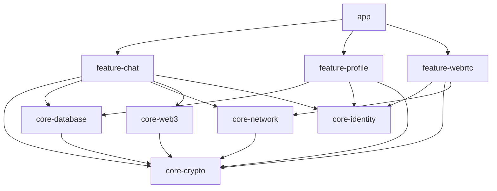

# CONTEXT 01: AEGIS MASTER ARCHITECTURE BLUEPRINT

## 1. System Vision & Product Identity
**Aegis: Shield of the Gods** is a sovereign, uncompromised end-to-end encrypted messaging terminal, WebRTC voice/video communicator, and in-chat Web3 financial interface. Engineered with zero-trust principles, Signal-grade privacy, hardware-backed Keystore security, and cyberpunk aesthetics.

## 2. Multi-Module Architecture Layout
```
AEGIS/
├── app/                  # Main entry point, Navigation, MainActivity, Cyberpunk ThemeEngine
├── core-crypto/          # Libsodium X25519 Double Ratchet, Google Tink Keystore AEAD, Argon2id KDF
├── core-database/        # Room Database with deterministic SQLCipher encryption & passphrase storage
├── core-identity/        # Ed25519 identity key generation, user profile registration & session management
├── core-network/         # Firebase Realtime message sync, offline queueing, MediaRepository
├── core-web3/            # BIP39 seed vault, EVM & Solana wallet managers, 0.5% developer fee engine
├── feature-chat/         # In-chat message stream, $send transaction parser, disappearing message timer
├── feature-profile/      # User settings, security dashboard, ephemeral stories, multi-theme selector
└── feature-webrtc/       # WebRTC 1-on-1 audio/video calling, STUN/TURN signaling, call UI
```

## 3. Inter-Module Dependency Graph


## 4. Application Entry & Lifecycle
- `AegisApplication`: Initializes Google Tink Keystore primitives, SQLCipher libraries, and WebRTC factory components.
- `MainActivity`: Applies `FLAG_SECURE` to prevent OS screenshots and memory scrapers, mounts `ThemeEngine.AegisTheme`, and manages root navigation (`AegisWelcomeScreen` -> `AegisMainContainer`).
