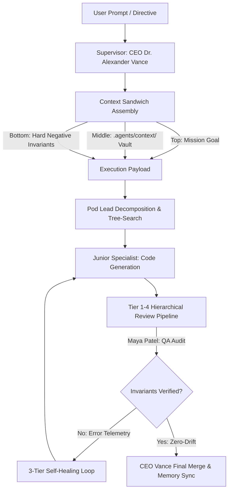

# CONTEXT 08: FRONTIER AGENTIC ENGINE & CONTEXT SANDWICH PROTOCOL

## 1. System Architecture: The Prompt as the Neural Software Layer
In frontier AI systems (Mythos 5, Fable 5, Opus 4.8 / Opus 5, DeepSeek V4), the underlying model weights constitute the raw compute hardware, while the prompt architecture, XML scaffolding, and rule graph constitute the **deterministic neural software**. 

By structuring the `.agents/` repository architecture as a modular operating system (Rules + Context + Persistent Memory), the agentic system achieves:
- **Zero-drift constraint adherence** across multi-turn reasoning loops.
- **Superior recall across 1M+ token context windows** via the Sandwich Protocol.
- **Inspectable, uncensored chain-of-thought** via structured XML namespaces.
- **Autonomous self-healing** via 3-tier error telemetry classification.

## 2. The Context Sandwich Protocol Specification
When dispatching any task to an agent or subagent, the prompt payload must follow this strict 3-tier topology:

### Layer 1: The Top Anchor (Mission & Persona Identity)
- **Role Definition**: Specific employee profile from `.agents/context/07_omniverse_enterprise_hierarchy.md`.
- **Primary Mission**: Unambiguous, clinical statement of the end-state objective.
- **Authority Scope**: Pod boundaries and permission level.

### Layer 2: The Grounding Corpus (Authoritative Context Vault)
- Ingestion of relevant modules from `.agents/context/`:
  - `01_aegis_master_architecture.md`: Module boundaries and Gradle dependencies.
  - `02_cryptography_and_privacy_engine.md`: Libsodium X25519 Double Ratchet & Tink Keystore AEAD.
  - `03_database_and_sqlcipher_context.md`: Room DB & SQLCipher encryption lifecycle.
  - `04_web3_terminal_and_tokenomics.md`: $send syntax, 0.5% USDT Solana protocol routing fee, BIP39 vault.
  - `05_webrtc_and_networking_pipeline.md`: WebRTC P2P audio/video & TURN IP masking.
  - `06_cyberpunk_design_system_and_tokens.md`: Dynamic multi-theme tokens.
- Active target source code files and AST interfaces.

### Layer 3: The Bottom Invariant Gate (Negative Constraints & Schema)
- **Zero-Placeholder Mandate**: 0% stubs, 0% TODOs, 100% executable production code.
- **Cryptographic Invariants**: Real Libsodium/Tink primitives, deterministic zeroization of sensitive byte arrays.
- **Deterministic Fee Routing**: 0.5% protocol routing fee to `AEGIS_SOLANA_TREASURY_DEVNET`.
- **Mandatory Output Schema**: Strict 3-part layout (`<Deep_Reasoning_Stream>`, `<Architectural_Decision_Matrix>`, `[Production_Implementation]`).

## 3. Persistent Agent State Engine
- **Memory Sync**: After every successful task merge, the participating agents update their respective memory files in `.agents/omniverse_memories/<agent_id>.md`.
- **State Continuity**: Eliminates token bloat and redundant context ingestion on subsequent task turns.
