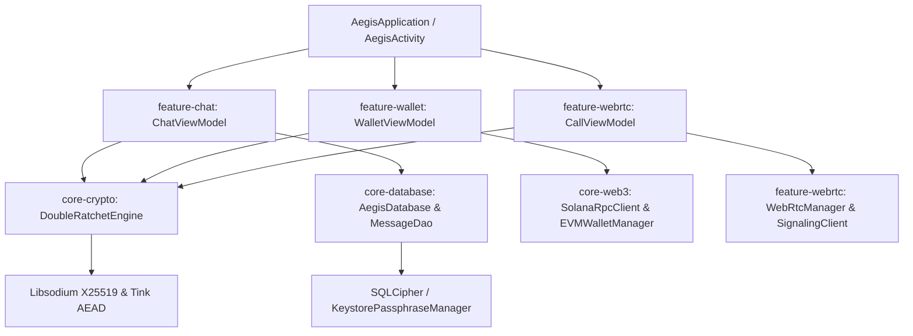

# CONTEXT 09: REPO-MAP & AST SYMBOL DEPENDENCY GRAPH

## 1. Architectural Topology & Symbol Index (High-Density Context)
This blueprint provides a concrete, PageRank-weighted Abstract Syntax Tree (AST) mapping of the entire Aegis Kotlin/Android codebase. Agents must use this symbol graph for direct file targeting without executing exploratory directory traversals.

---

## 2. Core Symbol Contracts by Module

### `core-crypto` (libsodium + Tink)
- **`DoubleRatchetEngine`** (`core-crypto/.../DoubleRatchetEngine.kt`):
  - `fun initializeSession(ourIdentity: KeyPair, theirIdentity: PublicKey, sharedSecret: ByteArray): RatchetSession`
  - `fun ratchetEncrypt(session: RatchetSession, plaintext: ByteArray): EncryptedPayload`
  - `fun ratchetDecrypt(session: RatchetSession, header: MessageHeader, ciphertext: ByteArray): ByteArray`
  - `fun zeroizeKey(keyBytes: ByteArray)`
- **`KeystoreEncryptor`** (`core-crypto/.../KeystoreEncryptor.kt`):
  - Uses Google Tink AEAD + Android Keystore (`AndroidKeysetManager`) for at-rest storage keys.

### `core-database` (SQLCipher + Room)
- **`AegisDatabase`** (`core-database/.../AegisDatabase.kt`):
  - In-memory/File-backed Room database with `net.zetetic.database.sqlcipher.SupportFactory`.
  - Passphrase generated via Argon2id from Keystore master seed; never stored as `java.lang.String`.
- **`MessageDao`** & **`ConversationDao`**:
  - `fun insertMessage(entity: MessageEntity): Long`
  - `fun getMessagesForConversation(conversationId: String, limit: Int, offset: Int): Flow<List<MessageEntity>>`
  - `fun purgeExpiredDisappearingMessages(cutoffTimestamp: Long): Int`

### `core-web3` (Solana + EVM + Reown)
- **`SolanaRpcClient`** (`core-web3/.../SolanaRpcClient.kt`):
  - Native JSON-RPC 2.0 client for Solana devnet/mainnet-beta.
  - `fun sendTransaction(signedTxBase64: String): Result<String>`
  - `fun getBalance(publicKeyBase58: String): Flow<Lamports>`
- **`ProtocolFeeRouter`** (`core-web3/.../ProtocolFeeRouter.kt`):
  - Enforces mandatory 0.5% developer protocol fee routing on all in-chat tipping and transfer transactions.
- **`Bip39Vault`** (`core-web3/.../Bip39Vault.kt`):
  - BIP39 12/24-word seed phrase generator and derivation path engine (m/44'/501'/0'/0' for Solana, m/44'/60'/0'/0/0 for EVM).

### `feature-webrtc` (Signal-Grade P2P Calling)
- **`SignalingClient`** (`feature-webrtc/.../SignalingClient.kt`):
  - E2EE WebSocket signaling client for SDP Offer/Answer and ICE candidates.
- **`WebRtcManager`** (`feature-webrtc/.../WebRtcManager.kt`):
  - PeerConnectionFactory manager with TURN relay IP masking and mandatory DTLS-SRTP encryption.

### `core-ui` & `theme` (Cyberpunk Design System)
- **`AegisTheme`** (`core-ui/.../Theme.kt`):
  - Dynamic token provider for `Neon`, `Dark Moon`, `Cyber Sunrise`, and `Classic Dark` palettes.
  - Custom composables: `AegisScaffold`, `AegisButton`, `NeonGlowBorder`, `CyberInput`.

---

## 3. AST Navigation Rules
1. Never guess package names or imports; verify against the exact symbol definitions above.
2. Any modifications to cryptographic signatures must preserve zeroization guarantees (`ByteArray.fill(0)` in `finally` blocks).
3. Cross-module calls must utilize Hilt/Koin dependency injection interfaces rather than static singleton instantiations.
