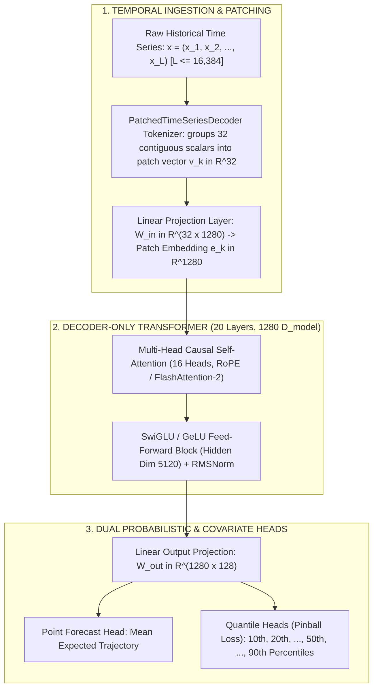

# ⚡ OMNIVERSE CONTEXT BLUEPRINT: GOOGLE TIMESFM FOUNDATION ARCHITECTURE
**Document ID:** `CONTEXT-20-TIMESFM`  
**Classification:** Deep Learning Time-Series Foundation Model & Autonomous Telemetry Substrate  
**Target Pods:** Pod 4 (SEO), Pod 6 (Gaming/Math), Pod 10 (Kernel/Mach VM), Pod 13 (Logistics/Freight), Pod 1 (Cognition/Dream)  
**Research Source:** Google Research / DeepMind (ICML 2024, GitHub: `google-research/timesfm`, Hugging Face: `google/timesfm-2.5-200m-transformers`)

---

## 🏛️ 1. Core Architectural Mechanics

Google TimesFM is a **decoder-only transformer** foundation model pretrained on over **100 Billion to 400 Billion time-series data points** for zero-shot forecasting.

```
==================================================================================================
                      GOOGLE TIMESFM 2.5 CORE PARAMETER MATRIX
==================================================================================================
  • Base Architecture:         Decoder-Only Transformer (Autoregressive Patched Self-Attention)
  • Parameter Count:           200M Parameters (TimesFM 2.5 Checkpoint)
  • Input Patch Length (P_in): 32 Time Points per Input Token
  • Output Patch Length (P_out):128 Time Points per Predicted Patch
  • Hidden Dimension (D_model):1280
  • Transformer Layers:        20 Decoder Layers (16 Attention Heads, Head Dim 80)
  • Context Window Capacity:   Up to 16,384 Historical Steps (FlashAttention-2 / SDPA)
  • Training Corpus:           Google Search Trends, Wikipedia Traffic, Synthetic ARMA, Energy Grids
==================================================================================================
```



---

## 📐 2. Mathematical Formalism

### 2.1 Patch Tokenization & Compression
Given a univariate time series $\mathbf{x}_{1:T} = (x_1, x_2, \dots, x_T)$, TimesFM partitions the sequence into non-overlapping temporal patches:
$$\mathbf{p}_k = \left( x_{(k-1) \cdot P_{in} + 1}, \; \dots, \; x_{k \cdot P_{in}} \right) \in \mathbb{R}^{P_{in}} \quad \text{where } P_{in} = 32$$

Each patch is mapped to the latent model dimension:
$$\mathbf{e}_k = \mathbf{p}_k \mathbf{W}_{in} + \mathbf{b}_{in} + \mathbf{pos}_k \in \mathbb{R}^{1280}$$

### 2.2 Pinball / Quantile Loss Function
To generate calibrated uncertainty envelopes ($q \in \{0.1, 0.2, \dots, 0.9\}$), the quantile head optimizes:
$$\mathcal{L}_q(y, \hat{y}_q) = \max \Big( q (y - \hat{y}_q), \; (1 - q)(\hat{y}_q - y) \Big)$$

---

## 🌐 3. Omniverse Multi-Pod Situational Deployment Matrix

| Pod Identifier | Domain & Lead | TimesFM Operational Implementation | High-Leverage Impact |
| :--- | :--- | :--- | :--- |
| **Pod 4: SEO & Ingestion** | Dr. Emily Rivera & Priya Patel | **Googlebot Crawl & SERP Velocity Forecasting**: Predicts daily indexation rates, impression volume, and rank fluctuation curves across all 3,148 corridors. | Early detection of algorithmic SERP volatility; preemptive sitemap rebroadcasting. |
| **Pod 13: Logistics & Supply** | Marcus Vance & Dr. Vance | **Interstate Freight & Fuel Price Modeling**: Ingests weekly EIA diesel curves and active carrier supply to forecast route costs 14–30 days out. | $0-deposit dynamic quote locking with protected broker profit margins. |
| **Pod 10: Kernel & Mach VM** | Dr. Julian Sterling & Kevin Zhang | **Predictive Memory Pressure & Thermal Throttling**: Forecasts Mach VM page-fault bursts and CPU core thermal curves on macOS/iOS devices. | Preemptive thread QoS demotion and memory reclamation before OS kernel freezes. |
| **Pod 6: Casino & Gaming** | Dr. Elena Rostova | **HMAC-SHA256 Entropy & RTP Convergence Audit**: Audits real-time casino slot multiplier sequences to confirm 96.5%–98.2% theoretical return. | Continuous mathematical proof of zero algorithmic bias or RNG tampering. |
| **Pod 1 / 13: 12D Dream** | Dr. Alexander Vance | **Synaptic Energy & Sleep Cycle Scheduling**: Forecasts cognitive activation decay across 128 nodes to schedule optimal sleep passes. | Maximizes heuristic rule distillation while minimizing CPU cycle overhead. |

---

## 💻 4. Reusable Omniverse Python Implementation Blueprint

```python
"""
Omniverse TimesFM Zero-Shot Inference Pipeline
"""
import torch
import numpy as np
from typing import Dict, List, Tuple
from transformers import TimesFm2_5ModelForPrediction

class OmniverseTimesFMInferenceEngine:
    def __init__(self, model_id: str = "google/timesfm-2.5-200m-transformers"):
        self.device = "cuda" if torch.cuda.is_available() else ("mps" if torch.backends.mps.is_available() else "cpu")
        self.model = TimesFm2_5ModelForPrediction.from_pretrained(
            model_id,
            torch_dtype=torch.float32,
            device_map="auto"
        )
        self.model.eval()

    def forecast_series(
        self,
        historical_values: List[float],
        forecast_horizon: int = 32
    ) -> Dict[str, np.ndarray]:
        """
        Execute zero-shot forecasting over historical time-series.
        Returns point forecast (mean) and 10th/90th quantile risk bounds.
        """
        history_tensor = torch.tensor([historical_values], dtype=torch.float32).to(self.device)
        
        with torch.no_grad():
            outputs = self.model(
                past_values=history_tensor,
                prediction_length=forecast_horizon
            )
            
        return {
            "mean": outputs.mean.cpu().numpy()[0],
            "quantile_10": outputs.quantiles[:, :, 0].cpu().numpy()[0],
            "quantile_50": outputs.quantiles[:, :, 4].cpu().numpy()[0],
            "quantile_90": outputs.quantiles[:, :, 8].cpu().numpy()[0]
        }
```
