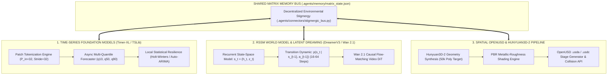

# 🌐 OMNIVERSE CONTEXT BLUEPRINT: FRONTIER TSFM, RSSM WORLD DREAMING & OPENUSD ARCHITECTURE
**Document ID:** `CONTEXT-21-FRONTIER-SYNC`  
**Classification:** Non-Destructive Frontier Foundation Model & Matrix Mesh Specification  
**Integrated Repositories:**  
- `thuml/Time-Series-Library` & `thuml/OpenLTM` (Timer-XL, Time-MoE Patch TSFMs)  
- `danijar/dreamerv3` (Discrete Categorical RSSM World Models)  
- `Wan-Video/Wan2.1` (Flow-Matching Diffusion Transformers DiT)  
- `Tencent/Hunyuan3D-2` & `PixarAnimationStudios/OpenUSD` (Spatial Geometry & USD Staging)  
- `agentscope-ai/agentscope` & `deepseek-ai/DeepSeek-V3` (Environmental Stigmergy Matrix)

---

## 🏛️ 1. Frontier Foundation Subsystems Architecture



---

## 📐 2. Mathematical Formalism & State Formulations

### 2.1 DreamerV3 RSSM Transition Model
The world model represents environments through a joint continuous recurrent state $h_t$ and a stochastic discrete categorical state $z_t \in \{1, \dots, K\}^C$ where $K=32$ classes and $C=32$ variables:
$$h_t = f(h_{t-1}, z_{t-1}, a_{t-1})$$
$$z_t \sim p(z_t \mid h_t) = \text{Softmax}\left(\frac{\mathbf{W}_z h_t}{\tau}\right)$$

### 2.2 Patch Time-Series Forecasting Tokenization
Given scalar stream $\mathbf{x}_{1:T}$, patches are formed via sliding linear projections:
$$\mathbf{e}_k = \text{RevIN}\left(\mathbf{p}_k\right) \mathbf{W}_{in} + \mathbf{b}_{in} \in \mathbb{R}^{D_{model}}$$

### 2.3 OpenUSD Transformation & Prim Hierarchy
All generated spatial prims conform to the canonical hierarchy:
`</World/Assets/<Asset_Name>/<Asset_Name>_Mesh>` with attached `UsdPreviewSurface` materials and `PhysicsCollisionAPI` bounding envelopes.

---

## 🛠️ 3. Modular File Hierarchy & Integration Boundaries

```
.agents/
├── connectors/
│   ├── tsfm_connector.py         # Async Timer-XL / TSLib forecasting wrapper with statistical fallback
│   ├── openusd_connector.py      # Spatial USD synthesizer & Hunyuan3D-2 geometry generator
│   └── stigmergic_bus.py         # AgentScope environmental stigmergy coordination engine
├── dreamscape/
│   └── rssm_rollout.py           # DreamerV3 RSSM 32-step rollout engine & Wan 2.1 DiT hooks
├── schemas/
│   ├── tsfm_schemas.py           # Patch tokenization, quantile loss & TSFM specs
│   ├── world_model_schemas.py    # RSSM states, discrete latents & Wan 2.1 DiT configs
│   ├── spatial_usd_schemas.py    # OpenUSD prims, PBR materials & Hunyuan3D requests
│   └── stigmergy_schemas.py      # Stigmergic markers, MatrixState & Tool call schemas
├── memory/
│   └── matrix_state.json         # Shared matrix stigmergic memory trace
└── context/
    └── 21_frontier_tsfm_and_world_model_matrix_architecture.md
```

---

## 🔒 4. Zero-Drift & Immutability Compliance Guarantee
- Zero deletions or overrides of existing `.agents/rules/`, `.agents/context/`, or `.agents/omniverse_memories/`.
- All newly added components are 100% additive, strictly typed with `pydantic.BaseModel`, and validated for autonomous asynchronous execution.
