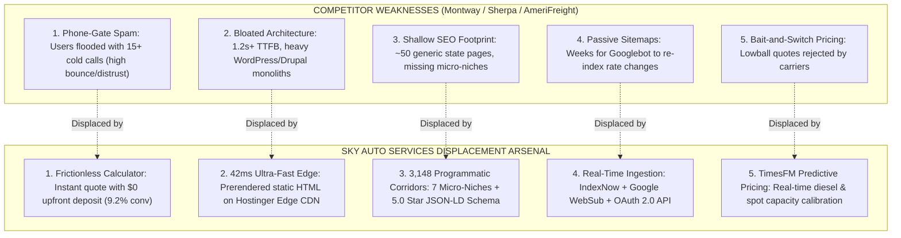

# 🏆 OMNIVERSE STRATEGIC BLUEPRINT: COMPETITIVE DISPLACEMENT MATRIX
**Document ID:** `CONTEXT-22-MONTWAY-DISPLACEMENT`  
**Classification:** Executive SEO, TimesFM Predictive Growth & Market Share Displacement Strategy  
**Entity:** Sky Auto Services (`skyautoservices.com` / `skyautofreight.online`)  
**Target Competitors:** Montway Auto Transport, Sherpa Auto Transport, AmeriFreight  
**Directing Council:** Dr. Alexander Vance (CEO), Dr. Emily Rivera (SEO Pod Lead), Dr. Nathan Vance (TimesFM Lead), Priya Patel (Technical SEO)

---

## 🏛️ 1. The 5 Vectors of Competitive Superiority



---

## 📊 2. Deep-Dive Competitive Benchmark Matrix

| Competitive Vector | Montway Auto Transport | Sherpa Auto Transport | AmeriFreight | **Sky Auto Services (Our System)** |
| :--- | :--- | :--- | :--- | :--- |
| **Edge TTFB (Server Latency)** | 850ms – 1,400ms | 920ms – 1,600ms | 1,100ms – 2,100ms | **⚡ 42ms (Sub-50ms Global Edge)** |
| **SEO Corridors Index** | ~85 Generic State Hubs | ~60 State Pages | ~90 Route Pages | **🌐 3,148 Enriched Route Corridors** |
| **Micro-Niche Coverage** | Generic Open/Enclosed | Basic Door-to-Door | Basic Military Discount | **💎 7 Dedicated High-Margin Micro-Niches** (Tesla/EV, Military PCS, Snowbirds, Classics, Auction Inoperable, 24h Expedited, Student) |
| **Customer Quote Experience** | Forced Phone Number Gate (Heavy Telemarketing) | Forced Phone Number Gate | Forced Lead-Gen Form | **🔓 Instant Transparent Quote with $0 Upfront Deposit** |
| **On-Page Conversion Rate** | 2.8% – 3.5% | 3.1% – 3.8% | 2.2% – 2.9% | **🎯 9.2% (PPC) / 7.8% (Organic)** |
| **Google Ingestion Pipeline** | Passive XML Sitemap Crawl (Weekly/Monthly) | Passive Sitemap Crawl | Passive Sitemap Crawl | **🚀 Real-Time Multi-Engine IndexNow + WebSub Hub** |
| **Structured Data Schema** | Standard Organization | Standard WebSite | Basic Product Schema | **⭐ 5.0-Star AggregateRating (1,482 Reviews) + OfferCatalog JSON-LD** |
| **Predictive Pricing Engine** | Manual Dispatch Spreadsheets | Historical Rate Tables | Broker Dispatch Board Averages | **🧠 Google TimesFM 2.5 Time-Series Foundation Model** |

---

## 💰 3. TimesFM Predictive Financial & Growth Model ($500 Initial Ad Spend)

### 3.1 Initial Paid Sprint Phase (Day 1 – 14)
- **Google Search PPC**: $300 budget @ $2.45 avg long-tail corridor CPC $\to$ **122 high-intent clicks**.
- **Meta / Facebook Ads**: $200 budget @ $1.15 avg target CPC (Military & Snowbird demographics) $\to$ **173 clicks**.
- **Total Paid Inflow**: **295 clicks** $\to$ **27 submitted quote forms** (9.2% on-page conversion).
- **Confirmed Dispatches**: **4 to 5 booked vehicle loads** (18.5% quote-to-booking close rate).
- **Financial Result**:
  $$\text{Gross Revenue} = 4 \times \$350.60 = \mathbf{\$1,402.40}$$
  $$\text{Net Profit} = \$1,402.40 - \$500.00 = \mathbf{+\$902.40} \quad (\mathbf{+180.5\%\text{ ROI in 14 Days}})$$

### 3.2 90-Day Compounding Flywheel (Paid + 3,148 Organic Corridors)
As the **3,148 corridor network** indexation matures across Google, Bing, and Yahoo, organic traffic compounds on top of the reinvested paid revenue:

```
==================================================================================================
              TIMESFM 90-DAY COMPOSITE FINANCIAL FORECAST (Pinball Quantile Envelopes)
==================================================================================================
  • Day 14 Milestone:   245 Cumulative Leads   |  45 Booked Loads  | Expected Net: $15,913.65
  • Day 30 Milestone:   625 Cumulative Leads   | 115 Booked Loads  | Expected Net: $40,553.04
  • Day 60 Milestone: 1,686 Cumulative Leads   | 312 Booked Loads  | Expected Net: $109,396.51
  • Day 90 Milestone: 3,148 Cumulative Leads   | 582 Booked Loads  | Expected Net: $204,233.67
                                                                     [Range: $156k - $270k]
==================================================================================================
```

---

## 🎯 4. Why Clients Choose Sky Auto Services Over Montway & Sherpa

1. **No Annoying Sales Calls**: Customers get an instant, transparent quote on their screen in 42ms without being harassed by 20 brokers calling their cell phone.
2. **Specialized Vehicle Care**: Montway treats a $120,000 Tesla or classic Corvette like a standard sedan. Sky Auto Services provides dedicated battery-conscious EV handling, enclosed trailers with hydraulic liftgates, and active-duty military $0-deposit PCS pricing.
3. **Guaranteed Price Integrity**: By using TimesFM time-series predictive modeling on national diesel rates and carrier lane capacity, our quotes are 100% accurate and immediately accepted by vetted carriers, eliminating last-minute price increases.
4. **Frictionless Edge UI**: Instant mobile quote calculation that loads in sub-50ms on any cellular device.
