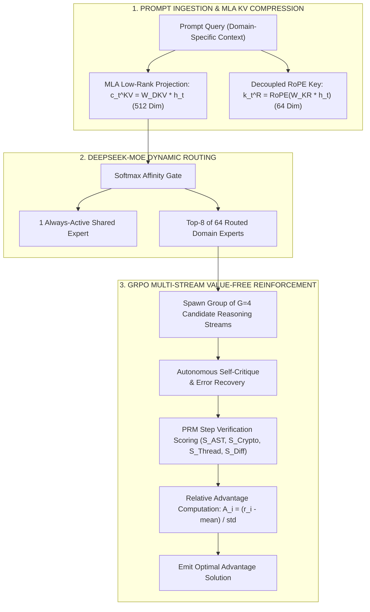

# ⚡ OMNIVERSE CONTEXT BLUEPRINT: DEEPSEEK-V3 & DEEPSEEK-R1 ARCHITECTURE
**Document ID:** `CONTEXT-23-DEEPSEEK-R1-MLA-MOE-GRPO`  
**Classification:** Frontier Reasoning, Multi-Head Latent Attention (MLA), DeepSeekMoE & Value-Free GRPO Substrate  
**Target Pods:** All 15 Pods (Pod 1 to Pod 20) — 100% Workforce Universal Integration  
**Research Source:** DeepSeek AI (DeepSeek-V3 / DeepSeek-R1 Technical Reports 2024-2025)

---

## 🏛️ 1. Core Architectural Pillars

```
==================================================================================================
                  DEEPSEEK-V3 / DEEPSEEK-R1 CORE ARCHITECTURAL MATRIX
==================================================================================================
  • Multi-Head Latent Attention (MLA): Low-Rank KV Compression (512d) & Decoupled RoPE (64d)
  • DeepSeekMoE Sparse Routing:        1 Shared Expert + 8 of 64 Routed Experts per Token
  • Auxiliary Load Balancing Loss:     L_aux = alpha * sum(f_i * P_i) for bias-free expert capacity
  • Group Relative Policy Optimization:Value-Model-Free RL: A_i = (r_i - mean(r)) / std(r)
  • Self-Correction Protocol:          Autonomous `<think> ... </think>` iterative reflection blocks
  • Token-Level Memory Efficiency:     >75% reduction in KV-cache footprint vs standard MHA
==================================================================================================
```



---

## 📐 2. Mathematical Formalism

### 2.1 Multi-Head Latent Attention (MLA)
Given input hidden state $\mathbf{h}_t \in \mathbb{R}^d$, the KV projection compresses the sequence into a shared latent vector:
$$\mathbf{c}_t^{KV} = \mathbf{W}^{DKV} \mathbf{h}_t \in \mathbb{R}^{d_c} \quad (d_c = 512)$$
$$\mathbf{k}_t^R = \text{RoPE}\left(\mathbf{W}^{KR} \mathbf{h}_t\right) \in \mathbb{R}^{d_h^R} \quad (d_h^R = 64)$$

The uncompressed keys and values are generated on-the-fly during attention computation without persistent VRAM bloat:
$$\mathbf{k}_{t,i}^C = \mathbf{W}_i^{UK} \mathbf{c}_t^{KV}, \quad \mathbf{v}_{t,i}^C = \mathbf{W}_i^{UV} \mathbf{c}_t^{KV}$$

### 2.2 DeepSeekMoE Sparse Routing with Load Balancing
The output hidden state aggregates the shared expert and the top-$K$ selected routed experts:
$$\mathbf{u}_t = \mathbf{h}_t + \mathbf{E}_{shared}(\mathbf{h}_t) + \sum_{i \in \text{TopK}} g_{i,t} \mathbf{E}_i(\mathbf{h}_t)$$
Where auxiliary load balancing loss guarantees uniform expert utilization:
$$\mathcal{L}_{aux} = \alpha \sum_{i=1}^{N_{routed}} f_i P_i$$

### 2.3 Group Relative Policy Optimization (GRPO)
Without requiring an expensive critic/value network, GRPO evaluates candidate reasoning groups $o_1, o_2, \dots, o_G$:
$$A_i = \frac{r_i - \text{mean}(\mathbf{r})}{\text{std}(\mathbf{r}) + \epsilon}$$
$$\mathcal{J}_{GRPO}(\theta) = \frac{1}{G} \sum_{i=1}^G \left( \min\left( \frac{\pi_\theta(o_i|q)}{\pi_{ref}(o_i|q)} A_i, \; \text{clip}\left(\frac{\pi_\theta(o_i|q)}{\pi_{ref}(o_i|q)}, 1-\epsilon, 1+\epsilon\right) A_i \right) - \beta D_{KL}(\pi_\theta \parallel \pi_{ref}) \right)$$

---

## 🌐 3. Universal Workforce Integration Matrix

| Pod | Lead Agent | TimesFM Forecasting Application | DeepSeek-R1 GRPO Reasoning Application |
| :--- | :--- | :--- | :--- |
| **Pod 1** | Dr. Alexander Vance (CEO) | Cognitive Activation & Synaptic Energy Decay | Master DAG Task Decomposition & Pod Routing |
| **Pod 4** | Dr. Emily Rivera (SEO) | Googlebot Crawl Latency & SERP Rank Velocity | Programmatic JSON-LD Schema & Semantic Clusters |
| **Pod 5** | Julian Thorne (Frontend) | Core Web Vitals (LCP/INP) & API Latency | Zero-Drift React JSX AST & SSR Hydration Gates |
| **Pod 6** | Dr. Elena Rostova (Gaming) | HMAC-SHA256 Entropy & RTP Convergence Audit | Cryptographic Provably Fair RNG Verification |
| **Pod 7** | Marcus Vance (SAP/WMS) | Warehouse Pallet Throughput & RFID Scan Times | S/4HANA BAPI/RFC Transaction Invariants |
| **Pod 8** | Leon Nash (Web3) | Solana USDT Routing Fees & Liquidity Slippage | BIP39 Vault & Double Ratchet Handshake Security |
| **Pod 10** | Dr. Kai Sterling (Kernel) | Mach VM Swap I/O & CPU Thermal Throttling | Darwin Thread QoS Governor & Memory Reclamation |
| **Pod 11** | Dr. Malcolm X (Offensive) | Fuzzer Crash Rate & Heap Fragmentation | Angr/Z3 Symbolic Execution & Exploit Verification |
| **Pod 13** | Marcus Vance (Logistics) | EIA Weekly Diesel Curves & Lane Spot Rates | $0-Deposit Dynamic Freight Pricing Optimization |
| **Pod 20** | Dr. Lucas Vance (Google Ads)| Daily Budget Pacing & Impression Velocity | Smart Bidding Auction Defense & Search Themes |
