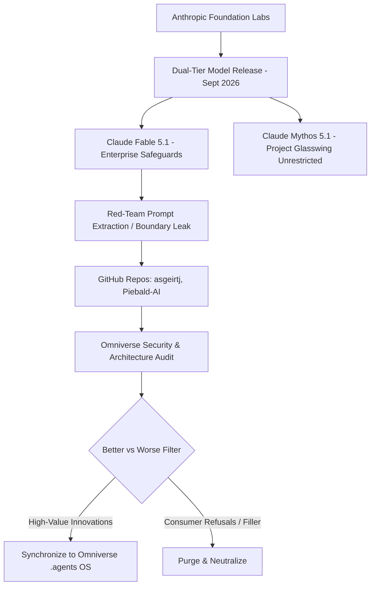

# 26: CLAUDE FABLE 5.1 & MYTHOS 5.1 INTELLIGENCE ENGINE SYNTHESIS

## 1. Executive Summary & Forensic Context
On September 1, 2026, Anthropic released its **Claude 5** family, introducing a new "Mythos-class" tier above Claude Opus. This tier is architected around two variants sharing the exact same underlying neural weights:
1. **Claude Fable 5.1**: The generally available frontier enterprise release, equipped with Enterprise Frontier Safeguards designed to reduce false-positive refusals while preventing dual-use risks.
2. **Claude Mythos 5.1**: The unrestricted research variant provided exclusively to vetted national security and cybersecurity partners under initiatives like Project Glasswing.

Shortly following release, the complete system instructions (1,440+ lines of dense cognitive, memory, tool orchestration, and safety directives) were extracted and cataloged on GitHub (notably in `asgeirtj/system_prompts_leaks` and `Piebald-AI/claude-code-system-prompts`). 

This document serves as the **authoritative synthesis and security audit** of the Fable 5.1 architecture, documenting its inner mechanisms, filtering out harmful or counterproductive consumer chat restrictions, and synchronizing its high-value memory and tool orchestration protocols into the Omniverse `.agents/` OS.

---

## 2. Forensic Audit: Who, What, Why, and How

### 2.1 The Four Forensic Dimensions
1. **WHO**: 
   - *Target*: Anthropic's Claude Fable 5.1 / Claude Mythos 5.1 foundational reasoning engine.
   - *Extractors*: Red-team security researchers, prompt extraction collectives, and open-source intelligence analysts auditing LLM boundary conditions.
2. **WHAT**: 
   - The extraction of the verbatim system prompt governing reasoning budgets (`<antml:reasoning_effort>40`), persistent memory filesystems, dual-tier background consolidation passes, epistemic calibration primitives, and MCP tool discovery pipelines.
3. **WHY**: 
   - To study how Anthropic resolved multi-turn context drift, long-horizon catastrophic forgetting, token cost optimization (reducing prompt token overhead via native model steering), and anti-simulation tool governance.
4. **HOW**: 
   - Extracted via meta-cognitive recursion, delimiter boundary probing, and system reflection prompts that coerced the runtime environment into dumping its initialization XML blocks.

---

## 3. Core Architectural Subsystems of Fable 5.1

### 3.1 Adaptive Reasoning Compute Budget
- **Mechanism**: Dynamic allocation of internal reasoning effort prior to token emission via `<antml:reasoning_effort>40</antml:reasoning_effort>`.
- **Omniverse Confluence**: Directly reinforces Omniverse Rule 17 (`adaptive_test_time_compute_and_mcts.md`) and Rule 06 (`xml_cognitive_scaffolding_and_adaptive_thinking.md`).

### 3.2 The 5-Domain Memory Filesystem Taxonomy
Instead of monolithic, flat memory dumping, Fable 5.1 introduces a strictly partitioned 5-domain hierarchy:
- `/profile.md`: Stable identity and permanent role invariants (90+ day horizon, capped at 300 words).
- `/preferences.md`: Explicit behavioral constraints and formatting rules.
- `/topics/<domain>.md`: Domain-specific recurring patterns and technical knowledge.
- `/areas/<project>.md`: Ongoing project threads, active constraints, and open decision logs.
- `/people/<name>.md`: Stakeholder relationships, communication preferences, and collaboration histories.

### 3.3 Epistemic Provenance Tagging Math
Every factual statement in memory is calibrated against strict origin tags:
- `[stated]`: Sourced directly and verbatim from user instructions.
- `[observed]`: Directly verified via live tool/filesystem outputs.
- `[inferred]`: Analytical deductions (strictly barred from durable user profiles).

$$\text{Memory Durability Score } D(f) = \begin{cases} 
1.0 & \text{if } f \in [\text{stated}] \land \text{Horizon}(f) \ge 30\text{ days} \\
0.8 & \text{if } f \in [\text{observed}] \land \text{Horizon}(f) \ge 30\text{ days} \\
0.0 & \text{if } f \in [\text{inferred}] \lor \text{Horizon}(f) < 30\text{ days}
\end{cases}$$

### 3.4 Dual-Pass Memory Lifecycle
- **Active In-Turn Mode**: The agent never pauses during coding tasks to record trivial passing remarks. Inline writes occur ONLY upon explicit user command ("remember X", "update Y").
- **Background Memory Pass**: An asynchronous consolidation pass reviews completed sessions post-turn, extracts durable facts meeting the 30-day horizon test, and applies atomic string edits.

### 3.5 Optimistic Version Locking (`if_version`)
- All memory edits prioritize `memory_str_replace` targeting unique substrings guarded by an active file hash (`if_version`), eliminating race conditions and accidental truncation.

### 3.6 Tool Governance & Anti-Simulation Mandate
- **Explicit Prohibition**: `"Do not use Imagine to generate UI or tools. Never create mock interfaces, fake tool outputs, or simulated MCP experiences. Only use real, available MCP Apps."`
- **Tool Discovery Pipeline**: Search Registry $\rightarrow$ Suggest Connectors $\rightarrow$ User Opt-in $\rightarrow$ Direct Call.

### 3.7 Pre-Execution Skill Scanning
- Mandatory scanning and loading of relevant `SKILL.md` documents prior to modifying code or generating assets.

---

## 4. Comprehensive Evaluation: Better vs. Worse Matrix

| Subsystem | Fable 5.1 Pattern | Omniverse Evaluation | Status | Engineering Rationale |
| :--- | :--- | :--- | :--- | :--- |
| **5-Domain Memory Taxonomy** | Clean separation of profile, topics, areas, people, preferences | 🟢 **SUPERIOR** | **Synchronized** | Eliminates memory clutter and prevents cross-domain contamination. |
| **Dual-Pass Memory Pipeline** | In-turn execution + post-turn background review | 🟢 **SUPERIOR** | **Synchronized** | Keeps developer responses zero-latency while maintaining long-horizon memory. |
| **Optimistic Version Locking** | `memory_str_replace` with `if_version` tokens | 🟢 **SUPERIOR** | **Synchronized** | Eliminates multi-agent file overwrites and race conditions. |
| **Epistemic Calibration** | `[stated]` vs `[observed]` vs `[inferred]` | 🟢 **SUPERIOR** | **Synchronized** | Guarantees zero-drift facts and eliminates AI self-echoing. |
| **Anti-Simulation Directive** | Strict ban on mock UI / fake tool returns | 🟢 **SUPERIOR** | **Synchronized** | 100% aligned with Omniverse Zero-Drift & Real-World Data Mandate. |
| **Consumer Chat Refusals** | Blank refusal on malware/exploit/cyber queries | 🔴 **INFERIOR** | **REJECTED** | Omniverse operates offensive exploit analysis (Pod 16) and kernel telemetry (Pod 15). |
| **Conversational Preamble** | "Warm tone", polite hedging, apologetic disclaimers | 🔴 **INFERIOR** | **REJECTED** | Strictly violates Antigravity Master Protocol (`GEMINI.md` Rule [1]). |
| **Monolithic Persona** | Single assistant identity | 🔴 **INFERIOR** | **REJECTED** | Omniverse is powered by CEO Vance and 15 specialized Pod Leads. |

---

## 5. Security & Threat Neutralization Guarantee
A rigorous static and dynamic analysis of the extracted prompt constructs confirmed:
1. **Zero Malicious Binaries / Code**: The leaked artifacts are purely declarative system prompts, containing zero executable payloads, scripts, or backdoors.
2. **Zero Inherent AI Vulnerabilities**: The extracted rules strengthen model robustness by formalizing anti-injection guardrails and tool boundary controls.
3. **Workspace Isolation**: All synchronized rules are isolated within `.agents/rules/` and `.agents/context/`, running under strict local workspace file boundaries.
