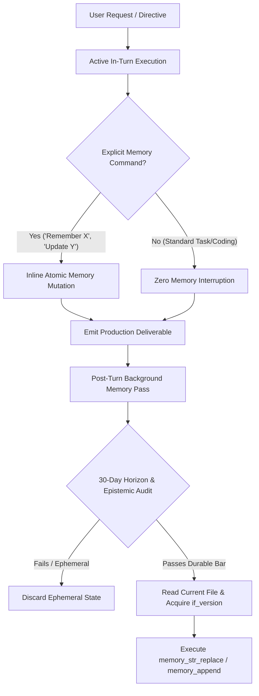

# RULE 20: FABLE 5.1 PERSISTENT MEMORY FILESYSTEM & DUAL-PASS PIPELINE

## 1. Executive Mandate & Purpose
This rule formalizes the integration of Anthropic's **Claude Fable 5.1 / Mythos 5.1** memory architecture into the Omniverse `.agents/` operating system. It defines the hierarchical 5-domain memory filesystem, optimistic version-locking mechanics (`if_version`), atomic string replacement protocols, and the two-tier execution lifecycle (Active In-Turn vs Background Pass) without degrading or replacing existing Omniverse pod hierarchies.

---

## 2. Hierarchical 5-Domain Memory Filesystem Structure
All persistent long-horizon agent memory outside of episodic logs must be organized into five strictly bounded domains:

```
.agents/memory/ (or .agents/memories/)
├── profile.md          # Stable user identity, role, and permanent traits (3+ month horizon)
├── preferences.md      # Behavioral formatting, tone, and response constraints
├── topics/             # Domain-specific knowledge, recurring interests, and habits
│   └── <domain>.md     # e.g., architecture.md, ecom.md, security.md
├── areas/              # Ongoing active projects, responsibilities, and open decisions
│   └── <project>.md    # e.g., sky-auto-seo.md, omniverse-os.md
└── people/             # Key stakeholders, collaborators, and communication profiles
    └── <name>.md       # e.g., dr-vance.md, client-contacts.md
```

### 2.1 Domain Boundary Definitions
1. **`/profile.md`**: Contains permanent facts about the user/organization that remain stable across 90+ days. Max length: 300 words. Never contains temporary sprint tasks or ephemeral deadlines.
2. **`/preferences.md`**: Defines how the AI must behave (e.g., formatting styles, directness, brevity, architectural paradigms). Does NOT store facts about the world or personal hobbies.
3. **`/topics/<domain>.md`**: Stores stable knowledge and recurring patterns in specific subject areas. A single passing mention is NOT filed; it is filed only when it recurs or when the user dwells on it.
4. **`/areas/<name>.md`**: Stores active multi-session projects, persistent technical constraints, unresolved architectural decisions, and current operational status.
5. **`/people/<name>.md`**: Stores relationship context, collaboration roles, and communication preferences for individuals interacting with the workspace.

---

## 3. Epistemic Provenance Tagging & Anti-Generalization Invariants

### 3.1 Strict Line-Level Provenance Tagging
Every durable factual claim written into memory files MUST be tagged with its epistemic origin:
- `[stated]`: The user explicitly and directly stated this fact.
- `[observed]`: Directly verified from live filesystem/tool execution results.
- `[inferred]`: Analytical deductions. **STRICT INVARIANT:** Inferred lines are NEVER persisted as user facts.

### 3.2 Calibration & Anti-Generalization Rules
1. **No Over-Generalization**: A single mention of a tool or preference is logged as `[stated] mentioned X once`, NEVER upgraded to `[stated] expert in X` or `[stated] prefers X for all tasks`.
2. **Origin Tracking (No Echoing)**: AI recommendations or suggestions that the user merely approved with "sounds good" or "ok" are logged as `[stated] approved <approach>`, NOT as user-authored technical specifications.
3. **One-Line-Per-Clause**: Avoid fragmenting single thoughts across multiple lines. Condense compound facts into single, high-density lines.
4. **The 30-Day Horizon Test**: If a fact will not be relevant or true in 30 days (e.g., "debugging line 42 on Tuesday"), it MUST NOT be written to durable memory.

---

## 4. Dual-Pass Memory Lifecycle Architecture



### 4.1 Tier 1: Active In-Turn Execution
- During active task execution, the agent focuses 100% of compute on solving the user's technical directive.
- The agent NEVER pauses mid-task to write passing conversational trivia.
- **Exception**: Explicit user commands ("remember that...", "update my preferences to...", "forget...") are executed inline during the turn.

### 4.2 Tier 2: Post-Turn Background Memory Pass
- After the primary deliverable is verified, the background memory consolidation pass evaluates the session against the 30-day horizon test.
- Durable updates are applied atomically to the appropriate 5-domain destination file.

---

## 5. Optimistic Version Locking & Atomic Mutation Protocols

### 5.1 Version-Guarded Edits (`if_version`)
To prevent multi-agent race conditions and accidental memory corruption, memory mutations must adhere to optimistic locking:
1. **`memory_str_replace` (Preferred)**: Targets an exact, unique substring (`old_str`) and replaces it with `new_str`. Requires passing the active file version hash.
2. **`memory_append`**: Appends a genuinely new, non-redundant factual line to the end of a file.
3. **`memory_write`**: Used ONLY for creating brand-new files with required YAML frontmatter, or when restructuring a completely corrupted file.

### 5.2 Mandatory YAML Frontmatter
Every file in `/topics/`, `/areas/`, and `/people/` must maintain standard frontmatter:
```yaml
---
name: <slug_matching_filename>
description: <one-line summary of contents and trigger conditions>
sources: [omniverse_os, agentic_pass]
aliases: [shorthand_1, shorthand_2]
---
```

---

## 6. Omniverse Pod Confluence Invariant
This rule does NOT alter or diminish the authority of the **CEO Dr. Alexander Vance** or any of the 15 Omniverse Pod Leads. Individual employee memory files (`.agents/omniverse_memories/<agent_id>.md`) remain the authoritative employee-level record, while the 5-domain memory filesystem governs project-wide, persistent architectural memory.
