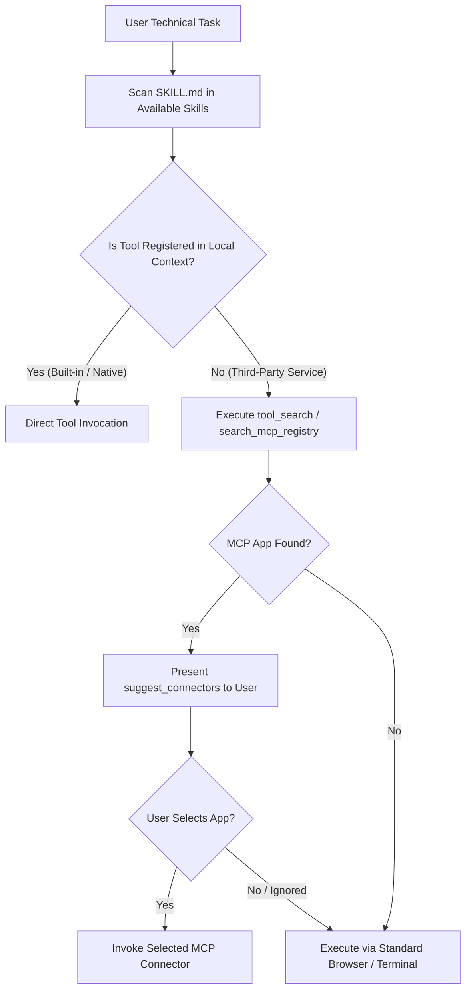

# RULE 21: FABLE MCP TOOL ORCHESTRATION & ANTI-SIMULATION DIRECTIVE

## 1. Executive Mandate & Purpose
This rule formalizes the tool orchestration, MCP integration, and anti-simulation protocols derived from the Anthropic **Claude Fable 5.1 / Mythos 5.1** architectural specification. It enforces a strict zero-simulation invariant across all tools, defines the standard Tool Discovery pipeline, and establishes mandatory `SKILL.md` pre-read enforcement.

---

## 2. Strict Anti-Simulation & Anti-Mock Directive
1. **Zero Synthetic / Mock UI Generation**: Under NO circumstances shall an agent generate synthetic visual mocks, fake tool return objects, or simulated MCP interactions (`"Do not use Imagine to generate UI or tools. Never create mock interfaces, fake tool outputs, or simulated MCP experiences."`).
2. **Real Tool Binding Only**: All tool calls must bind directly to authentic environment tools, live MCP servers, or verified terminal execution endpoints.
3. **Fail-Fast Uncertainty Invariant**: If a required tool, API endpoint, or data payload is unavailable, the agent MUST immediately halt and report the exact missing dependency rather than fabricating a simulated return.

---

## 3. Tool Discovery & Execution Protocol

### 3.1 Third-Party MCP App Isolation (`[third_party_mcp_app]`)
- Third-party consumer connectors (e.g., streaming, booking, food delivery, payment routing) require explicit user selection prior to execution.
- Finding a third-party tool in a registry does NOT license direct silent execution; the agent must suggest the connector and wait for user selection, EXCEPT when:
  1. The user explicitly named the specific provider in the prompt (e.g., *"Deploy to Hostinger via SSH"*).
  2. The user previously established a standing preference for that connector.
  3. The tool is a core workspace utility (e.g., `view_file`, `replace_file_content`, `run_command`).

---

## 4. Mandatory `SKILL.md` First-Read Invariant
Before generating code, modifying configurations, or executing complex domain pipelines:
1. The agent MUST scan the `<skills>` catalog for plausibly relevant skills (e.g., `modern-web-guidance`, `a11y-debugging`, `memory-leak-debugging`, etc.).
2. The agent MUST execute `view_file` on the corresponding `SKILL.md` before executing any modifying tool.
3. **Rationale**: Skills encode environment-specific constraints, rendering quirks, and output paths that are not present in baseline weights. Skipping the skill read compromises production reliability.

---

## 5. Security & Isolation Guarantee
All tools and scripts executed within the Omniverse workspace are subject to strict static validation:
- Zero obfuscated code, base64 payloads, dynamic `eval()`, or unverified binary downloads.
- All file edits use explicit, audited paths within the user's workspace boundaries.
- Cryptographic keys and sensitive environment variables are zeroized from telemetry logs.
